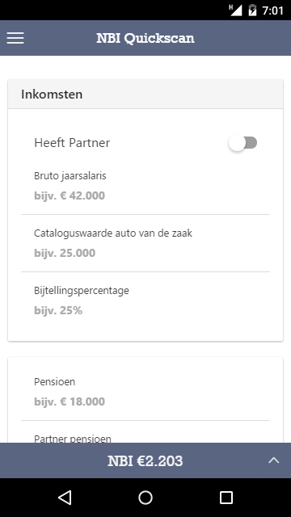

> Handige tool voor financieel adviseurs om op eenvoudige wijze eventuele hiaten bloot te leggen. 
> 
> * In een oogopslag doorrekenen van de gebruikelijke scenario’s (langleven, kortleven, AO WW) op basis van besteedbaar inkomen. Op deze manier kan op een simpele en snelle manier een inzicht gegeven worden van het netto besteedbaar inkomen bij verschillende scenario’s.
> 
> * Bepalen van verzekeringsbehoefte bij verschillende gebeurtenissen (Woonlastenverzekering, ORV)

Voor vragen of opmerkingen ben ik bereikbaar via [Twitter](https://twitter.com/mdworldnl).

Please address any questions or remarks to my [Twitter](https://twitter.com/mdworldnl).

This is my first real privately produced Android app, although I've worked on several apps through my employer before.

The app was built with the [Ionic framework](http://ionicframework.com/) and contains many [Karma unit tests](http://karma-runner.github.io/) for the calculations. It also provided me with an interesting source of working with [Gulp](http://gulpjs.com/) and [Cordova hooks](https://cordova.apache.org/docs/en/dev/guide/appdev/hooks/).

